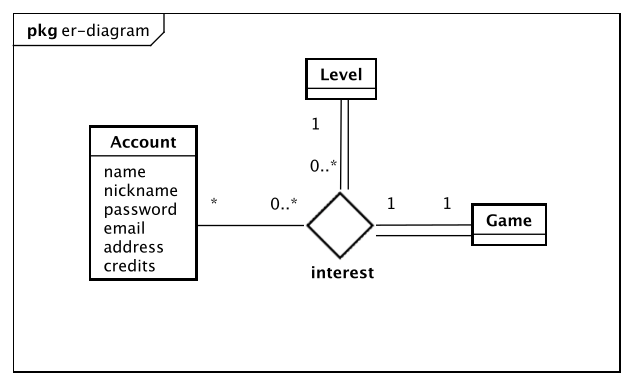
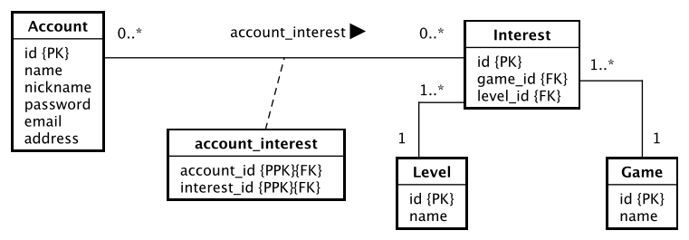

## ☕️ Java Playground

This is my playground for learning and practicing Java, Spring Boot, and other related technologies.

## Table of contents
- [Description](#description)
- [List of Requirements](#requirements)
- [ER Design and Diagram](#er)
- [Logical Design and Diagram](#logical)
- [Run locally](#run)
- [Swagger](#swagger)
- [H2](#h2)
- [Tests](#test)

## <a name="description"></a> ✍︎ Description

A directory of gamers that allows users to have an account, a list of favorite games with their level, share credits with other gamers and plenty of search functionality.


## <a name="requirements"></a> ⎋ Requirements

> User domain
  - [x] sign up and create an account.
  - [ ] sign in and get account details.
  - [ ] update account details.
  - [ ] delete account.
  - [ ] have a list of favorite games.
  - [ ] add a game with a level to their favorite list of games.
  - [ ] remove a game from their favorite list of games.
  - [ ] give credit to other individual gamers.

> Search functionality
  - [ ] search for all games.
  - [ ] search for games by specifying the number of top games desired to see.
  - [ ] search for games by level.
  - [ ] search for games with maximum credits for each game based on their level.
  - [ ] search for other gamers based on gamers address/geographic location.
  - [ ] search for other gamers based on gamers favorite games.
  - [ ] search for other gamers based on gamers game's level.
  - [ ] search for other gamers based on gamers nickname.
  - [ ] search for other gamers based on gamers name.

## <a name="er"></a> ⌖ ER model

- An `Account` has zero-to-many `Interest` and the following attributes:
  - name, nickname, email, password and address.
- The same `Interest` can be associated with many `Account` and it has:
  - game, level of that game.





## <a name="logical"></a> ⎔ Logical model

- An `Account` has many-to-many relationship with`Interest`, so an association table is created.
- An `Interest` has one `Game` and one `Level`.
- A `Game` belongs to one-to-many `Interest`.
- A `Level` belongs to one-to-many `Interest`.




## <a name="run"></a> ⚙️ Running the API locally

```shell
git clone https://github.com/asterixcode/spring-rest-gamers-api.git
```
```shell
cd spring-rest-gamers-api
```
```shell
mvn clean install
```
```shell
mvn spring-boot:run
```

---
<a name="swagger"></a> The OpenAPI Swagger documentation can be access at:

- http://localhost:8080/swagger-ui/index.html

---
<a name="h2"></a> H2 in-memory database console can be accessed at:

- http://localhost:8080/h2-console/

H2 login details
```yaml
JDBC URL: jdbc:h2:mem:gamers-db
Username: sa
Password: <empty>
```

## <a name="test"></a> ⚙️ Running the test

```shell
mvn clean test
```


