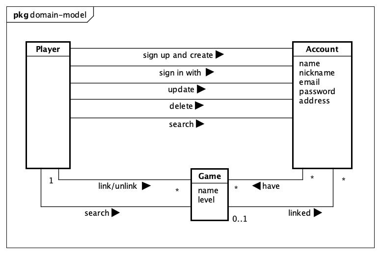
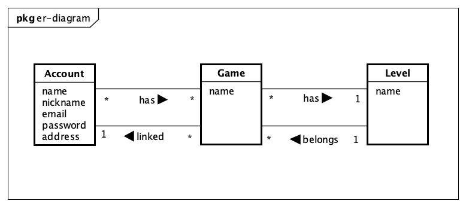
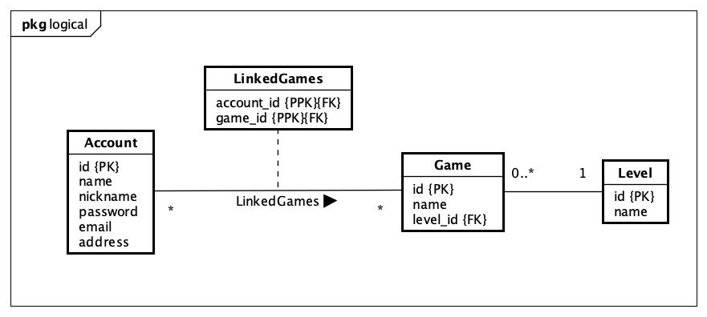

## Table of contents
- [Description](#description)
- [List of Requirements](#requirements)
- [Domain Model](#dm)
- [ER Model](#er)
- [Logical Model](#logical)
- [How to Build and Run Locally](#run)
- [Swagger](#swagger)
- [H2](#h2)
- [How to Run Tests](#test)

## <a name="description"></a> ✍︎ Description

A REST service providing a directory of players, their geographic location, which games they play and their level at the game.

A relational database to persist data.

## <a name="requirements"></a> ⎋ Requirements

<details>
  <summary><b>Player</b></summary>

- [x] can sign up by creating an account with name, nickname, email, password and address.
- [ ] can sign in with account details.
- [ ] can update account details: name, nickname, email, password and address.
- [ ] can delete account.
- [ ] can link a game with a level to its account.
- [ ] can unlink a game with a level from its account.
</details>

<details>
  <summary><b>Search</b></summary>

- [ ] search for all games.
- [ ] search for games by level.
- [ ] search for other players based on game.
- [ ] search for other players based on game's level.
- [ ] search for other players based on nickname.
- [ ] search for other players based on name.
- [ ] search for other players based on address/geographic location.
- [ ] search for other players based on email.
</details>

## <a name="dm"></a> ♾ Domain Model

Domain model designed based on the requirements.



## <a name="er"></a> ⌖ ER Model

Entity relationship diagram designed based on the domain model and requirements.

Please note that the following rules are applied:

In general:

- An `Account` has many games `Game`.
- A `Game` can be associated to many `Account`.
- A `Game` has one `Level`.
- A `Level` can be associated with many `Game`.

Specifically:

- A given `Account` can be linked to many `Game`.
- A given `Game` can be linked only once to a given `Account`.
- A given `Level` belongs to many `Game`.
- A given `Game` linked to one `Account` has only one `Level`.




## <a name="logical"></a> ⎔ Logical Model

- `Account` has PK `id`, unique `email`, unique `nickname`.
- `Game` has a PK `id`, unique `name`.
- `Level` has a PK `id`, unique `name`.
- An `Account` can be linked to many `Game`, and a `Game` can be linked to many `Account`, so an association table `LinkedGame` is created.
    - `LinkedGame` has PPKs and FKs `account_id` and `game_id`.
    - `LinkedGame` has a unique constraint on `account_id` and `game_id`.
    - `LinkedGame` has a FK `level_id`.




## <a name="run"></a> ⚙️ Build and Run Locally

To run locally, make sure first that you have postgres server running in your local machine.

```shell
git clone https://github.com/asterixcode/java-spring-playground.git
```
```shell
cd rest-postgres
```
```shell
mvn clean install
```
```shell
mvn spring-boot:run
```

---
<a name="swagger"></a> The OpenAPI Swagger documentation can be access at:

- http://localhost:8080/swagger-ui/index.html

---
<a name="h2"></a> `@Deprecated` 

H2 in-memory database console can be accessed at:

- http://localhost:8080/h2-console/

H2 login details
```yaml
JDBC URL: jdbc:h2:mem:gamers-db
Username: sa
Password: <empty>
```

## <a name="test"></a> ⚙️ How to Run Tests

```shell
mvn clean test
```


